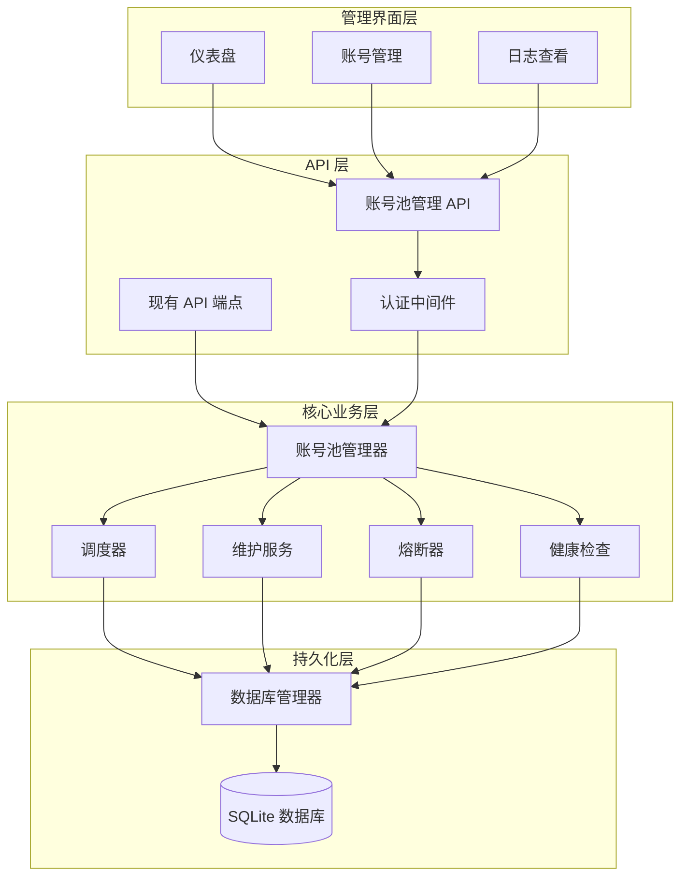

# 设计文档

## 概述

账号池管理系统是一个全自动化的多账号管理解决方案,作为 Suno API 项目的内部实现层,对外部 API 调用方完全透明。系统通过 SQLite 数据库实现持久化存储,使用 better-sqlite3 库提供高性能的同步数据库操作。核心设计包括智能负载均衡、自动保活机制、熔断保护和可视化管理界面。

**设计目标:**
- 零感知接入: 现有 API 接口保持完全不变
- 智能调度: 基于轮询和模型匹配的负载均衡
- 自动维护: 定时保活和健康检查
- 完整监控: 可视化仪表盘和日志查询

## 架构

系统采用分层架构设计,从下到上分为: 持久化层、核心业务层、API 层和管理界面层。



**架构说明:**

1. **持久化层**: 使用 SQLite 数据库存储账号信息、系统配置和日志。选择 better-sqlite3 库因其同步 API 简单易用,性能优于异步库,且内存管理由 JavaScript 垃圾回收器自动处理。

2. **核心业务层**: 包含账号池管理器、调度器、维护服务、熔断器和健康检查等核心组件。所有业务逻辑集中在此层,确保关注点分离。

3. **API 层**: 现有 API 端点保持不变,仅修改内部实现从环境变量改为从账号池获取账号。新增账号池管理 API 用于 CRUD 操作,通过认证中间件保护。

4. **管理界面层**: 基于 Next.js 的 React 组件,提供仪表盘、账号管理和日志查看功能。


## 组件和接口

### 1. 数据库管理器 (DBManager)

**职责:** 封装所有数据库操作,提供类型安全的 CRUD 接口。

**接口定义:**

```typescript
interface Account {
  id: string;                    // UUID 格式的唯一标识
  cookie: string;                // Suno 账号的完整 Cookie 字符串
  status: 'active' | 'disabled'; // 账号状态
  supportedModels: string[];     // 支持的模型列表,空数组表示支持所有模型
  note: string;                  // 备注信息
  lastUpdated: number;           // 最后更新时间戳(毫秒)
}

interface SystemConfig {
  key: string;                   // 配置键名
  value: string;                 // 配置值
  updatedAt: number;             // 更新时间戳
}

interface MaintenanceLog {
  id: number;                    // 自增 ID
  accountId: string;             // 关联的账号 ID
  operation: string;             // 操作类型: init/maintenance/circuit_break/manual_recover
  status: 'success' | 'failed';  // 操作结果
  message: string;               // 详细信息或错误消息
  timestamp: number;             // 操作时间戳
}

class DBManager {
  private db: Database;
  
  constructor(dbPath: string);
  
  // 账号操作
  addAccount(account: Omit<Account, 'id' | 'lastUpdated'>): Account;
  getAccount(id: string): Account | null;
  getAllAccounts(): Account[];
  updateAccount(id: string, updates: Partial<Account>): boolean;
  deleteAccount(id: string): boolean;
  
  // 系统配置操作
  getConfig(key: string): string | null;
  setConfig(key: string, value: string): void;
  
  // 日志操作
  addLog(log: Omit<MaintenanceLog, 'id' | 'timestamp'>): void;
  getLogs(filters?: { accountId?: string; limit?: number; offset?: number }): MaintenanceLog[];
  
  // 事务支持
  transaction<T>(fn: () => T): T;
}
```

**实现细节:**

- 使用 better-sqlite3 的同步 API
- 在 Next.js 环境中使用 globalThis 实现单例模式,避免开发模式下热重载导致的连接泄漏
- 数据库文件路径: `./data/account-pool.db`
- 所有写操作使用 WAL 模式提高并发性能

**数据库表结构:**

```sql
-- 账号表
CREATE TABLE accounts (
  id TEXT PRIMARY KEY,
  cookie TEXT NOT NULL,
  status TEXT NOT NULL CHECK(status IN ('active', 'disabled')),
  supported_models TEXT NOT NULL,  -- JSON 数组字符串
  note TEXT NOT NULL DEFAULT '',
  last_updated INTEGER NOT NULL
);

-- 系统配置表
CREATE TABLE system_config (
  key TEXT PRIMARY KEY,
  value TEXT NOT NULL,
  updated_at INTEGER NOT NULL
);

-- 维护日志表
CREATE TABLE maintenance_logs (
  id INTEGER PRIMARY KEY AUTOINCREMENT,
  account_id TEXT NOT NULL,
  operation TEXT NOT NULL,
  status TEXT NOT NULL CHECK(status IN ('success', 'failed')),
  message TEXT NOT NULL,
  timestamp INTEGER NOT NULL
);

-- 索引
CREATE INDEX idx_accounts_status ON accounts(status);
CREATE INDEX idx_logs_account_id ON maintenance_logs(account_id);
CREATE INDEX idx_logs_timestamp ON maintenance_logs(timestamp DESC);
```

### 2. 账号池管理器 (AccountPool)

**职责:** 管理账号生命周期,提供账号选择和状态管理功能。

**接口定义:**

```typescript
interface AccountSelectionOptions {
  model?: string;                // 可选的模型参数
  requireModelFilter: boolean;   // 是否需要模型筛选
}

class AccountPool {
  private dbManager: DBManager;
  private roundRobinIndex: number;
  private maintenanceTimer: NodeJS.Timeout | null;
  
  constructor(dbManager: DBManager);
  
  // 初始化
  async initialize(): Promise<void>;
  
  // 账号选择
  selectAccount(options: AccountSelectionOptions): Account | null;
  
  // 账号管理
  addAccount(cookie: string, supportedModels: string[], note: string): Promise<Account>;
  updateAccountStatus(id: string, status: 'active' | 'disabled'): Promise<boolean>;
  removeAccount(id: string): boolean;
  
  // 维护操作
  startAutoMaintenance(intervalMinutes: number): void;
  stopAutoMaintenance(): void;
  performMaintenance(): Promise<void>;
  
  // 统计信息
  getPoolStats(): {
    total: number;
    active: number;
    disabled: number;
    lastMaintenance: number | null;
  };
}
```

**实现细节:**

- 维护内存中的活跃账号列表,从数据库加载后缓存
- 轮询索引使用原子操作确保线程安全
- 账号选择算法:
  1. 如果需要模型筛选,先过滤出支持指定模型的账号
  2. 在过滤后的账号列表中使用轮询算法选择
  3. 如果没有可用账号,返回 null

### 3. 调度器 (Scheduler)

**职责:** 实现负载均衡算法,选择合适的账号处理请求。

**接口定义:**

```typescript
class Scheduler {
  private accountPool: AccountPool;
  
  constructor(accountPool: AccountPool);
  
  // 轮询调度
  roundRobin(accounts: Account[]): Account | null;
  
  // 基于模型的筛选
  filterByModel(accounts: Account[], model: string): Account[];
}
```

**实现细节:**

- 轮询算法: 维护一个全局索引,每次选择后递增并取模
- 模型筛选: 如果账号的 supportedModels 为空数组,视为支持所有模型
- 筛选逻辑: `account.supportedModels.length === 0 || account.supportedModels.includes(model)`

### 4. 维护服务 (MaintenanceService)

**职责:** 执行账号保活和健康检查操作。

**接口定义:**

```typescript
interface MaintenanceResult {
  accountId: string;
  success: boolean;
  newCookie?: string;
  error?: string;
}

class MaintenanceService {
  private sunoApi: typeof SunoApi;
  private dbManager: DBManager;
  
  constructor(sunoApi: typeof SunoApi, dbManager: DBManager);
  
  // 健康检查
  async healthCheck(account: Account): Promise<boolean>;
  
  // 保活操作
  async keepAlive(account: Account): Promise<MaintenanceResult>;
  
  // 批量维护
  async maintainAll(accounts: Account[]): Promise<MaintenanceResult[]>;
}
```

**实现细节:**

- 健康检查: 调用 SunoApi 的 `get_limit` 接口验证 Cookie 有效性
- 保活操作: 使用现有的 SunoApi 类,传入账号 Cookie,执行一次轻量级操作
- 如果保活成功且获取到新 Cookie,更新数据库
- 所有操作结果记录到 maintenance_logs 表

### 5. 熔断器 (CircuitBreaker)

**职责:** 自动识别和隔离失效账号。

**接口定义:**

```typescript
class CircuitBreaker {
  private accountPool: AccountPool;
  private dbManager: DBManager;
  
  constructor(accountPool: AccountPool, dbManager: DBManager);
  
  // 处理认证错误
  handleAuthError(accountId: string, error: any): void;
  
  // 检查是否应该熔断
  shouldBreak(error: any): boolean;
}
```

**实现细节:**

- 监听 API 请求中的 401 和 403 错误
- 当检测到认证错误时,立即将账号状态更新为 disabled
- 记录熔断日志到数据库
- 熔断判断逻辑:
  ```typescript
  shouldBreak(error: any): boolean {
    return error.response?.status === 401 || error.response?.status === 403;
  }
  ```

### 6. 认证中间件 (AuthMiddleware)

**职责:** 保护管理 API 端点,验证管理员身份。

**接口定义:**

```typescript
interface AuthCredentials {
  username: string;
  password: string;
}

class AuthMiddleware {
  private dbManager: DBManager;
  
  constructor(dbManager: DBManager);
  
  // 验证凭证
  async verify(credentials: AuthCredentials): Promise<boolean>;
  
  // 初始化管理员密码
  async initializePassword(): Promise<string>;
  
  // 修改密码
  async changePassword(oldPassword: string, newPassword: string): Promise<boolean>;
  
  // 中间件函数
  middleware(req: NextRequest): Promise<NextResponse | null>;
}
```

**实现细节:**

- 使用 bcrypt 库进行密码哈希,salt rounds 设置为 12
- 管理员用户名固定为 "super"
- 密码存储在 system_config 表中,key 为 "admin_password_hash"
- 首次启动时如果没有密码,生成随机临时密码并记录到日志
- 认证方式: HTTP Basic Auth
- 密码验证:
  ```typescript
  async verify(credentials: AuthCredentials): Promise<boolean> {
    if (credentials.username !== 'super') return false;
    const hash = this.dbManager.getConfig('admin_password_hash');
    if (!hash) return false;
    return await bcrypt.compare(credentials.password, hash);
  }
  ```


## 数据模型

### 账号实体 (Account)

```typescript
interface Account {
  id: string;                    // UUID,系统生成
  cookie: string;                // 完整的 Cookie 字符串
  status: 'active' | 'disabled'; // 账号状态
  supportedModels: string[];     // 支持的模型列表
  note: string;                  // 备注信息
  lastUpdated: number;           // 最后更新时间戳
}
```

**字段说明:**
- `id`: 使用 UUID v4 生成,确保全局唯一
- `cookie`: 从 Suno 网站获取的完整 Cookie 字符串,包含所有认证信息
- `status`: 只有 active 状态的账号会被调度器选择
- `supportedModels`: 空数组表示支持所有模型,非空数组表示仅支持列表中的模型
- `note`: 用于标识账号用途或来源,如 "测试账号"、"生产账号 1"
- `lastUpdated`: 毫秒级时间戳,每次更新账号信息时自动更新

### 系统配置 (SystemConfig)

```typescript
interface SystemConfig {
  key: string;                   // 配置键名
  value: string;                 // 配置值
  updatedAt: number;             // 更新时间戳
}
```

**预定义配置项:**
- `twocaptcha_key`: 2Captcha API 密钥
- `admin_password_hash`: 管理员密码的 bcrypt 哈希值
- `last_maintenance_time`: 上次维护时间戳
- `maintenance_interval`: 维护间隔(分钟)

### 维护日志 (MaintenanceLog)

```typescript
interface MaintenanceLog {
  id: number;                    // 自增 ID
  accountId: string;             // 关联的账号 ID
  operation: string;             // 操作类型
  status: 'success' | 'failed';  // 操作结果
  message: string;               // 详细信息
  timestamp: number;             // 操作时间戳
}
```

**操作类型:**
- `init`: 系统启动时的初始化验证
- `maintenance`: 定时维护操作
- `circuit_break`: 熔断操作
- `manual_recover`: 手动恢复操作
- `health_check`: 健康检查


## 正确性属性

*属性是一个特征或行为,应该在系统的所有有效执行中保持为真——本质上是关于系统应该做什么的形式化陈述。属性作为人类可读规范和机器可验证正确性保证之间的桥梁。*

### 属性 1: 数据库持久化一致性

*对于任何* 账号数据,当添加到数据库后立即查询,应该返回相同的账号信息(包括 ID、Cookie、状态、支持模型、备注)

**验证需求: 3.1, 3.2, 3.3**

### 属性 2: 轮询算法公平性

*对于任何* 包含 N 个活跃账号的账号池,连续调用 N 次账号选择(不指定模型),每个账号应该被选中恰好一次

**验证需求: 5.1, 5.2, 5.4**

### 属性 3: 模型筛选正确性

*对于任何* 指定模型 M 的请求,返回的账号要么支持模型列表为空(支持所有模型),要么支持模型列表包含 M

**验证需求: 6.1, 6.2, 6.3**

### 属性 4: 熔断器隔离性

*对于任何* 账号,当其在请求中返回 401 或 403 错误时,该账号的状态应该立即变为 disabled,且后续的账号选择不应该返回该账号

**验证需求: 8.1, 8.2, 8.3**

### 属性 5: 配置更新即时生效

*对于任何* 系统配置项,更新后立即查询应该返回新值,无需重启系统

**验证需求: 1.1, 1.2, 1.4**

### 属性 6: 账号添加时的健康检查

*对于任何* 新添加的账号,如果 Cookie 无效,添加操作应该失败并返回明确的错误信息

**验证需求: 10.1**

### 属性 7: Cookie 脱敏一致性

*对于任何* 通过查询 API 返回的账号信息,Cookie 字段应该只显示前 10 个字符,其余部分被替换为星号

**验证需求: 10.2**

### 属性 8: 删除操作完整性

*对于任何* 被删除的账号,删除后该账号不应该出现在数据库查询结果中,也不应该被账号选择算法返回

**验证需求: 10.4**

### 属性 9: 维护日志完整性

*对于任何* 维护操作(初始化、定时维护、熔断、手动恢复),操作完成后应该在日志表中存在对应的记录,包含账号 ID、操作类型、状态和时间戳

**验证需求: 4.4, 7.5, 8.4, 17.4**

### 属性 10: 密码哈希不可逆性

*对于任何* 管理员密码,存储在数据库中的值应该是 bcrypt 哈希值,且无法通过数据库中的值反推出原始密码

**验证需求: 15.5**

### 属性 11: 认证失败拒绝访问

*对于任何* 管理 API 请求,如果未提供有效的认证凭证(用户名 "super" 和正确密码),应该返回 401 未授权错误

**验证需求: 14.3, 14.4**

### 属性 12: 启动自愈触发条件

*对于任何* 系统启动,如果当前时间与上次维护时间的差值超过维护间隔,应该立即触发一次全量维护

**验证需求: 9.1, 9.2**

### 属性 13: 重试机制账号切换

*对于任何* 请求,当使用某个账号失败(认证错误)时,系统应该自动选择另一个可用账号重试,且失败的账号应该被标记为 disabled

**验证需求: 16.1, 16.4**

### 属性 14: 手动恢复健康检查

*对于任何* 从 disabled 状态手动恢复为 active 状态的账号,系统应该先执行健康检查,只有检查成功才将其加入可用账号列表

**验证需求: 17.1, 17.2, 17.3**

### 属性 15: 接口类型路由差异

*对于任何* 生成类接口(generate、custom_generate)的请求,账号选择应该考虑模型参数;对于查询类接口(get、get_limit)的请求,账号选择应该忽略模型参数

**验证需求: 18.1, 18.2**


## 错误处理

### 1. 数据库错误

**场景:** 数据库文件损坏、磁盘空间不足、权限问题

**处理策略:**
- 在 DBManager 构造函数中捕获数据库初始化错误
- 记录详细错误日志到控制台
- 如果是首次启动,尝试创建数据库文件和表结构
- 如果数据库已存在但无法打开,抛出致命错误并终止进程
- 对于写操作失败,使用事务回滚确保数据一致性

**错误码:**
- `DB_INIT_FAILED`: 数据库初始化失败
- `DB_WRITE_FAILED`: 数据库写入失败
- `DB_READ_FAILED`: 数据库读取失败

### 2. 账号验证错误

**场景:** 添加账号时 Cookie 无效、健康检查失败

**处理策略:**
- 在添加账号前先执行健康检查
- 如果健康检查失败,返回明确的错误信息,包含失败原因
- 不将无效账号保存到数据库
- 记录验证失败日志

**错误码:**
- `INVALID_COOKIE`: Cookie 格式无效或已过期
- `HEALTH_CHECK_FAILED`: 健康检查失败
- `ACCOUNT_VALIDATION_FAILED`: 账号验证失败

### 3. 账号池空错误

**场景:** 所有账号都被禁用,没有可用账号

**处理策略:**
- 在账号选择时检查可用账号数量
- 如果没有可用账号,返回 null
- API 层捕获 null 返回,向客户端返回 503 Service Unavailable
- 错误响应包含详细信息: "No available accounts in pool"
- 记录警告日志

**错误码:**
- `NO_AVAILABLE_ACCOUNTS`: 没有可用账号

### 4. 模型不支持错误

**场景:** 请求的模型没有任何账号支持

**处理策略:**
- 在模型筛选后检查结果账号列表
- 如果为空,返回明确的错误信息
- API 层返回 400 Bad Request,错误信息: "Model {model} is not supported by any account"
- 记录警告日志

**错误码:**
- `MODEL_NOT_SUPPORTED`: 请求的模型不被任何账号支持

### 5. 认证错误

**场景:** 管理 API 请求缺少认证信息或认证失败

**处理策略:**
- 在认证中间件中检查 Authorization 头
- 如果缺失,返回 401 Unauthorized,包含 WWW-Authenticate 头
- 如果认证失败,返回 401 Unauthorized,错误信息: "Invalid credentials"
- 记录认证失败日志,包含请求 IP 地址

**错误码:**
- `AUTH_REQUIRED`: 需要认证
- `AUTH_FAILED`: 认证失败

### 6. 维护操作错误

**场景:** 定时维护或手动维护失败

**处理策略:**
- 捕获维护过程中的所有异常
- 对于单个账号维护失败,记录日志但继续处理其他账号
- 如果账号维护失败,将其标记为 disabled
- 维护完成后返回汇总结果,包含成功和失败的账号数量
- 记录详细的维护日志

**错误码:**
- `MAINTENANCE_FAILED`: 维护操作失败
- `KEEP_ALIVE_FAILED`: 保活操作失败

### 7. 并发冲突错误

**场景:** 多个请求同时修改同一账号状态

**处理策略:**
- 使用数据库事务确保原子性
- 在更新账号状态前先检查当前状态
- 如果状态已被其他请求修改,返回冲突错误
- 客户端可以重试操作

**错误码:**
- `CONCURRENT_MODIFICATION`: 并发修改冲突

## 测试策略

### 单元测试

单元测试用于验证具体示例、边界情况和错误条件。重点测试以下场景:

**DBManager 测试:**
- 添加账号后能够正确查询
- 更新账号状态能够持久化
- 删除账号后无法查询到
- 事务回滚能够恢复数据
- 并发读写不会导致数据损坏

**AccountPool 测试:**
- 初始化时加载所有活跃账号
- 空账号池返回 null
- 单个账号池总是返回该账号
- 账号状态更新后立即生效

**Scheduler 测试:**
- 轮询算法在 2 个账号间交替选择
- 模型筛选正确过滤不支持的账号
- 空模型列表视为支持所有模型

**CircuitBreaker 测试:**
- 401 错误触发熔断
- 403 错误触发熔断
- 其他错误不触发熔断
- 熔断后账号状态变为 disabled

**AuthMiddleware 测试:**
- 正确的用户名和密码通过验证
- 错误的用户名验证失败
- 错误的密码验证失败
- 密码哈希存储和验证正确

### 属性测试

属性测试用于验证通用属性在所有输入下都成立。使用 [fast-check](https://github.com/dubzzz/fast-check) 库进行属性测试,每个测试至少运行 100 次迭代。

**测试配置:**
```typescript
import fc from 'fast-check';

// 每个属性测试运行 100 次
const testConfig = { numRuns: 100 };
```

**属性测试列表:**

1. **属性 1: 数据库持久化一致性**
   - 生成随机账号数据
   - 添加到数据库
   - 立即查询并验证数据一致性
   - **Feature: account-pool-management, Property 1: 数据库持久化一致性**

2. **属性 2: 轮询算法公平性**
   - 生成随机数量(1-10)的账号
   - 连续调用 N 次账号选择
   - 验证每个账号被选中恰好一次
   - **Feature: account-pool-management, Property 2: 轮询算法公平性**

3. **属性 3: 模型筛选正确性**
   - 生成随机账号列表,每个账号有随机的支持模型列表
   - 生成随机模型名称
   - 调用账号选择并验证返回的账号支持该模型
   - **Feature: account-pool-management, Property 3: 模型筛选正确性**

4. **属性 4: 熔断器隔离性**
   - 生成随机账号
   - 模拟 401/403 错误
   - 验证账号状态变为 disabled
   - 验证后续选择不返回该账号
   - **Feature: account-pool-management, Property 4: 熔断器隔离性**

5. **属性 5: 配置更新即时生效**
   - 生成随机配置键值对
   - 更新配置
   - 立即查询并验证新值
   - **Feature: account-pool-management, Property 5: 配置更新即时生效**

6. **属性 7: Cookie 脱敏一致性**
   - 生成随机长度(>10)的 Cookie 字符串
   - 调用查询 API
   - 验证返回的 Cookie 只显示前 10 个字符
   - **Feature: account-pool-management, Property 7: Cookie 脱敏一致性**

7. **属性 8: 删除操作完整性**
   - 生成随机账号并添加到数据库
   - 删除账号
   - 验证查询返回 null
   - 验证账号选择不返回该账号
   - **Feature: account-pool-management, Property 8: 删除操作完整性**

8. **属性 9: 维护日志完整性**
   - 生成随机维护操作
   - 执行操作
   - 查询日志并验证存在对应记录
   - **Feature: account-pool-management, Property 9: 维护日志完整性**

9. **属性 11: 认证失败拒绝访问**
   - 生成随机用户名和密码(非正确凭证)
   - 调用认证中间件
   - 验证返回 401 错误
   - **Feature: account-pool-management, Property 11: 认证失败拒绝访问**

10. **属性 15: 接口类型路由差异**
    - 生成随机接口类型和模型参数
    - 调用账号选择
    - 验证生成类接口考虑模型,查询类接口忽略模型
    - **Feature: account-pool-management, Property 15: 接口类型路由差异**

### 集成测试

集成测试验证多个组件协同工作的场景:

**端到端流程测试:**
- 系统启动 → 初始化数据库 → 加载账号 → 处理请求 → 返回响应
- 添加账号 → 健康检查 → 保存到数据库 → 可被选择
- 请求失败 → 熔断 → 切换账号 → 重试成功
- 定时维护 → 更新 Cookie → 记录日志

**管理界面测试:**
- 登录 → 查看仪表盘 → 显示统计信息
- 添加账号 → 验证 → 显示在列表中
- 编辑账号 → 更新 → 立即生效
- 删除账号 → 确认 → 从列表中移除

### 测试数据生成器

使用 fast-check 的 arbitrary 生成器创建测试数据:

```typescript
// 账号生成器
const accountArbitrary = fc.record({
  cookie: fc.string({ minLength: 20, maxLength: 200 }),
  status: fc.constantFrom('active', 'disabled'),
  supportedModels: fc.array(fc.constantFrom('chirp-crow', 'chirp-v3', 'chirp-v2'), { maxLength: 3 }),
  note: fc.string({ maxLength: 100 })
});

// 模型名称生成器
const modelArbitrary = fc.constantFrom('chirp-crow', 'chirp-v3', 'chirp-v2', 'unknown-model');

// 配置键值对生成器
const configArbitrary = fc.record({
  key: fc.string({ minLength: 1, maxLength: 50 }),
  value: fc.string({ maxLength: 200 })
});
```

### 测试覆盖率目标

- 单元测试: 核心业务逻辑覆盖率 > 90%
- 属性测试: 所有正确性属性都有对应的测试
- 集成测试: 主要用户流程全覆盖
- 边界情况: 空输入、最大值、并发冲突等

